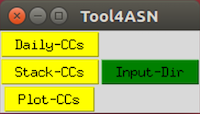
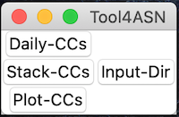

# Tool4ASN - Software to compute cross correlations with different stacking methodologies

   
---

This is a module to compute cross correlations with different stacking methodologies

## Installation:

You can easily install the python modules with: 

**pip install Tool4ASN**

Once installed, to run it just type on Terminal/command-promp **"Tool4ASN"** and a window as below should appear:

---

Example with Linux Ubuntu

---

Example with MacOS:

---

Enjoy! 

